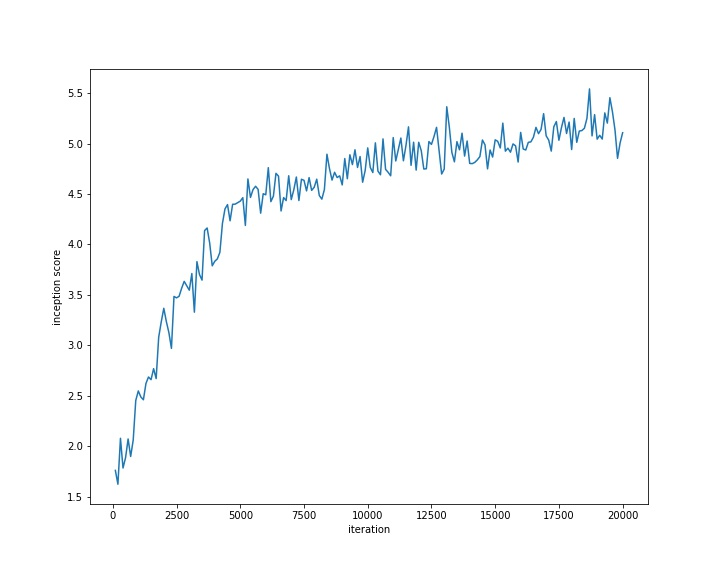
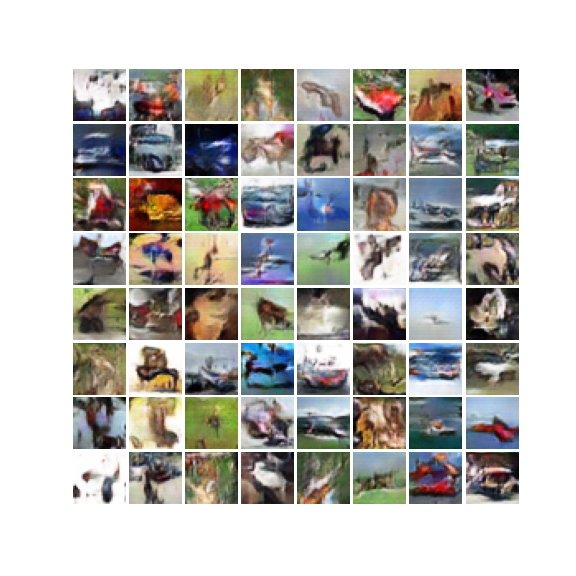
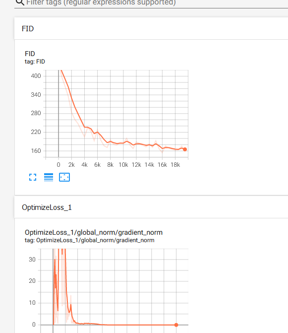

深度学习课程 技术报告代码实现
=====================================

## 实验环境

- Python, NumPy, SciPy, Matplotlib, Pickle， Tensorflow 1.x
- Google Colab

## 数据集下载

每个模型的数据集都是公开的，MNIST, SVHN的下载URL在文件中。
CIFAR-10数据集需要在官方链接中下载：[The CIFAR-10 dataset](http://www.cs.toronto.edu/~kriz/cifar.html), 下载python 版本后，放在`wgan.ipynb`所在目录下即可

## 运行方式

运行`wgan.ipynb`即可

所有模型的配置都在顶部的常量列表中指定

- `fid.py`: 实验中为数据集预先计算的统计数据. 放在`stats/`目录下，如要更改需要在`main`函数中`stats_path`指定文件路径
- `Inception score.py`: 若需修改计算IS的数据集，需要在该文件中`DATA_URL`指定文件路径

## 实验结果
- IS 
  

- images
  

- tensorboard
  

## 参考引用

- Official TF implementation: [bioinf-jku/TTUR](https://github.com/bioinf-jku/TTUR)
- improved WGAN:[igul222/improved_wgan_training](https://github.com/igul222/improved_wgan_training#readme)